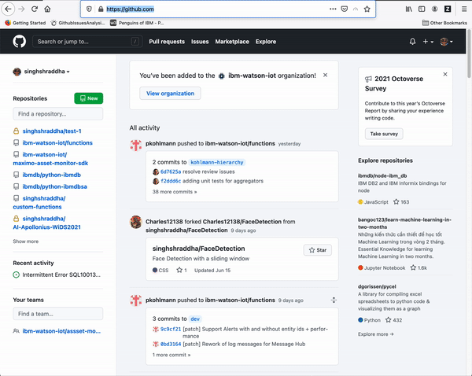
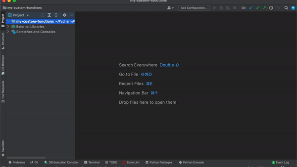
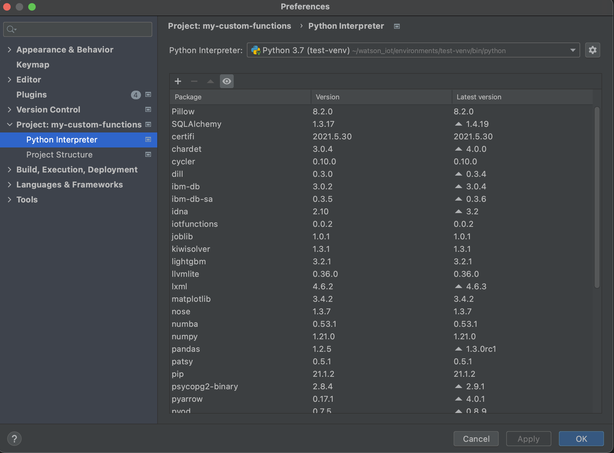
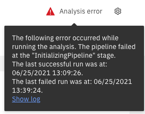
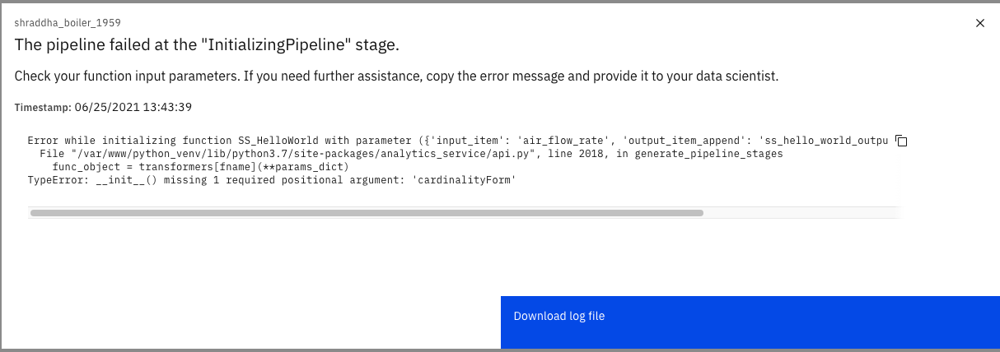

<!--- links to maintain (maximo monitor) --->
<!--- Introduction --->
[documentation]: https://www.ibm.com/docs/en/maximo-monitor/8.4.0?topic=analytics-tutorial-adding-custom-function
<!--- Understanding custom-functions  --->
[Understanding Custom Function]: UnderstandingCustomFunction.md

<!--- Registering custom-functions --->
[MAS credentials]: https://www.ibm.com/docs/en/maximo-monitor/8.4.0?topic=monitor-connection-parameters

# Custom-Function Starter Package

[](https://www.python.org/downloads/release/python-370/)

This package builds user understanding of custom-functions in Maximo Monitor. It 
contains sample custom-function packages and scripts to build and deploy a custom-function

To get an overview of when to use custom-functions, and to understand the different parts of a custom-functions 
refer to [Understanding Custom Function]. The document provides examples for different types of 
custom-function

-----------

## Table of Contents 

- [Pre-Requisites](#pre-requisites)

- [Creating git repository](#creating-git-repository)

- [Creating custom-functions](#creating-custom-functions)
    - [Open git repository in pycharm](#open-new-repository-in-pycharm)
    - [Set up virtual environmetn in pycharm](#set-up-the-virtual-environment)
    - [Create new custom-function](#create-new-custom-function)

- [Debugging Locally](#testing-locally)

- [Registering custom-functions](#registering-custom-function)

- [Verifying in UI](#verifying-in-ui)

- [Debugging In Pipeline](#debugging-in-pipeline)

- [Unregistering custom-functions](#unregistering-custom-function)

-----------

## Pre-Requisites

We start our journey with the set-up required to successfully develop and use a custom-function. All development and
 tutorials in this package use PyCharm IDE. To get started make sure you have the following installed on your machine.

- Python > 3.6
    - Check [python version](https://learnpython.com/blog/check-python-version/)
    - Download [python > 3.6](https://www.python.org/downloads/)
- Install [Pycharm](https://www.jetbrains.com/pycharm/download/#section=windows) community edition
- Learning Resources <br>
    - [UnderstandingCustomFunction](UnderstandingCustomFunction.md) <br>
    - Checkout project from [git repository in Pycharm](https://www.jetbrains.com/help/pycharm/set-up-a-git-repository.html#clone-repo)
    - Creating a [virtual environment in Pycharm](https://www.jetbrains.com/help/pycharm/creating-virtual-environment.html)
    - Testing and [debugging](https://www.jetbrains.com/help/pycharm/debugging-code.html) in Pycharm
    - Learn about [dataframes](https://pandas.pydata.org/docs/getting_started/intro_tutorials/01_table_oriented.html)
    - Learn about [inheritance](https://pythonbasics.org/inheritance/) 
    - Learn about [classmethod](https://pythonbasics.org/classmethod/)

-----------

## Creating Git Repository

You must create an external repository, such as in GitHub or GitLab, to host the function code. The best approach is 
to use a private repository and use a personal access token to access the function.

For instructions for creating tokens, for GitHub, see 
[Creating a personal access token](https://docs.github.com/en/github/authenticating-to-github/keeping-your-account-and-data-secure/creating-a-personal-access-token)
and for GitLab, see 
[Creating a deploy token](https://docs.gitlab.com/ee/user/project/deploy_tokens/)
.
<br>

#### Repository Structure

We use the directory structure shown below for creating and organizing the custom-functions. While this structure is
 not required we will be using and referring to it in the tutorial. Download the zip file to download this 
starter repository structure.

```bash
├── project
│   ├── custom
│   │   ├── __init__.py
│   │   ├── **/*.py
│   ├── scripts
|   │   ├── **/*.py
│   ├── dev_resources
│   ├── requirements.txt
│   ├── setup.py
│   ├── README.md
│   └── .gitignore
```

- All the python files with custom-function classes go in the `custom` package
- The `__init__.py` within the `custom` folder is required to make it a package  
- All testing scripts go in the `scripts` directory
- The credentials go in `dev_resources` directory. **NOTE** that in this package we add **dev_resources**
  directory in .gitignore to prevent credential leaks. If you chose to put your credentials in a
  different folder make sure to NOT push the credentials file to your github
- `setup.py` is required to make the repository pip installable
  
#### Create new repository
- In [Github](https://github.com/), create a private empty repository <br>

- Create and save [personal access token](https://docs.github.com/en/github/authenticating-to-github/keeping-your-account-and-data-secure/creating-a-personal-access-token)

-----------
## Creating custom-functions

All git activities assume you have generated and added ssh keys to you git account. 
[Learn more](https://docs.github.com/en/github/authenticating-to-github/connecting-to-github-with-ssh/checking-for-existing-ssh-keys) 
about connecting to github vis ssh
#### 1. Open new project in PyCharm
Clone your empty repository in pycharm using `Get from VCS` option in pycharm.
[Learn more](https://www.jetbrains.com/help/pycharm/set-up-a-git-repository.html#clone-repo) 
about how to checkout a git repository in pycharm <br>


#### 2. Get `advanced_custom_function_starter` branch in new project
- Right click on your project `my-custom-functions` in the project window
- Select Open In >> Terminal
- In the terminal, follow this sequence of commands to get the starter code into your empty private repository's main 
  branch
```bash
git remote -v            
git remote add starter https://github.com/ibm-watson-iot/functions.git         
git fetch starter
git checkout --orphan main starter/advanced_custom_function_starter
```


#### 3. Set up virtual environment
- Learn how to create a 
[python virtual environment in pycharm](https://www.jetbrains.com/help/pycharm/creating-virtual-environment.html#python_create_virtual_env)
- Create a new virtual environment for your project 
- Click on `requirements.txt` in you projects window
- Right click on top of `requirements.txt` file and choose "Install All Packages"
- All the required packages will be installed in the virtual env assosiated to your project


#### 4. Create new custom-function
- Add a `dev_resources` folder in the working directory. You can use this to store credentials required later. _Make sure 
  this folder is in `.gitignore` file_
- Add a new python file in `custom` folder
- Pick a BaseClass to inherit from. Refer to i. base classes in [Understanding Custom Function].
- Add `def execute(self, df)` method. Refer to ii execute method in [Understanding Custom Function].
- Add `def __init__(self, *args)` and `def baseui(cls)` methods. Refer to iii build ui classmethod in 
  .[Understanding Custom Function]
- A complete example for a new custom-function is provided in [hello_world.py](./custom/hello_world.py)


-----------

## Testing Locally

We use python scripts for all local testing. Learn how to 
[run](https://www.jetbrains.com/help/pycharm/running-without-any-previous-configuring.html) and 
[debug](https://www.jetbrains.com/help/pycharm/debugging-code.html) 
your python scripts in Pycharm

###### Transformers
To locally test the `execute` method of transformers there are two options available. The example scripts can be 
used as is when testing method/s added instead of the `execute` method, i.e the `_calc`  or `get_data` method. Refer 
to execute method section in [Understanding Custom Function] to learn about alternate methods 
used to define custom 
calculations

- Use random data for testing locally, as shown in [local_test_using_random_data.py](./scripts/local_test_using_random_data.py)
- Use .csv file data for testing locally, as shown in [local_test_using_csv_data.py](./scripts/local_test_using_csv_data.py)

Both scripts involve calling the `execute(self, df)` method of the transformer function with a dataframe as input 
parameter. This dataframe consists of the metrics required by the function and is indexed with `[deviceid, timestamp]` 
columns.

###### Aggregators
To locally test the `execute(self, group)` method of aggregators we fist define a granularity as a pandas group. A 
granularity has three components - deviceid column, timestamp column with time-based frequency, and optional 
dimension columns. The next step is to create aggregate groups using the granularity

```python
#STEP 1: define the granularity as a commas separated list of columns
grain = [ 'deviceid', # or corresponding column name for device id
          pd.Grouper(key='evt_timestamp', freq='1H'), # key: timestamp column name; freq: time base for aggregation
          'dimension' # column name for any dimension/s column for this grain
        ]

#STEP 2: construct groups by calling group method on input data
aggreagtion_groups = df.groupby(grain)
```

The last step is different for simple and complex aggregators. To test classes that inherit from SimpleAggregator we 
use the `agg` method (example assumes a single source)
```python
#STEP 3: apply the execute function on all the groups
output_dataframe = aggreagtion_groups.agg({fn.source: fn.execute})
```
To test classes that inherit from ComplexAggregator we use the `apply` method
```python
#STEP 3: apply the execute function on all the groups
output_dataframe = aggreagtion_groups.apply(fn.execute)
```

An example script for testing aggregators is [local_test_aggregators.py](./scripts/local_test_aggregators.py). The 
example shows how to locally test a simple aggregator and a complex aggregator


_Disclaimer_ : While local testing tests the logic you've implemented, it does not gaurantee that the function 
will run successfully within the function pipeline

-----------
## Registering custom-function


The name of the registered custom-function is the same as the class name of your custom-function. The 
custom-function name MUST be unique to a tenant.

#### 1. Push local changes to github
After testing the function locally add, commit, and push all the changes to github to prepare for the next step

#### 2. Retrieving and saving credentials

**Important**: The credentials file is used to run or test functions locally. Do not push this file to any external
 repository. In this package we add **dev_resources** directory in .gitignore to prevent credential leaks. If
  you chose to put your credentials in a different folder make sure to NOT push the credentials file to your github

To get and store credentials in SaaS follow these steps:

1. Create a credentials.json file in the `dev_resources` folder in your working directory. 
2. On the user interface, go to the **Services** tab.
3. Select Watson IoT Platform Analytics and click **View Details**.
4. In the Environment Variables field, click **Copy to Clipboard**.
5. Paste the contents of the clipboard into the credentials.json file.

Learn how to build  [MAS credentials]. Same as above save these credentials in a `credentials.json` file in the 
`dev_resources` folder

   
####3.  Register function

Follow the steps in [register.py](./scripts/register.py) and run the script to register your custom-function to your 
tenant. <br>
**Important**  When using a private repository you will add your personal 
access token created in the [create new repository](#create-new-repository) step to the PACKAGE_URL in `register.py`.
To prevent leaking your personal access token do NOT push the register.py file to your github. Either delete your 
token before you push the file or add it to .gitignore


-----------
## Unregistering custom-function

Delete all the derived metrics you defined using a custom-function before deleting the function. Follow the steps  
in [unregister.py](./scripts/unregister.py) and run the script to register your custom-function to your tenant. <br>

-----------
## Verifying in UI

- On the `Data` tab select the `create new` button
- Search for your registered custom-function
- Provide the required input and output
- Create the data item/s
- (if auto-schedule) The pipeline will run within next 5 min


-----------
## Debugging In Pipeline

This step is necessary if the UI shows `Analysis Error`.
messages 
until the point of faliure
<br>
<br>
1. Click on `Analysis Error` >> `Show log`
<br>

<br>
<br>
2. Download the log file to understand and further debug the error

<br>
<br>
3. If the debugging suggests an error in the custom-function, follow these steps 
  - Delete the data_item/s assosiated with the custom-function
  - Unregister the custom-function
  - Fix and push the new and improved custom-function to github
  - Register the new custom-function
  - Verify in the UI again


